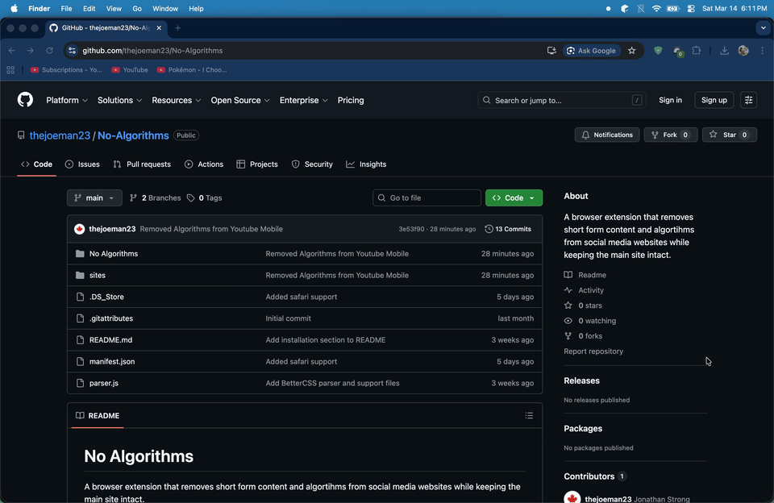

# No Algorithms
A browser extension that removes short form content and algortihms from social media websites while keeping the main site intact.
#### Time sink -> Tool

## Features (Youtube only, more coming soon...)
- Removed the home page and repalced with subscriptions page (only watch what you signed up for)
- Removed all Shorts or links to Shorts
- Removed all reccomendations
- No off button or toggle 😲

## Installation (Chrome)
1. Clone repository
2. Unzip the downloaded folder
3. Navigate to "Manage Extensions" on Chrome
4. Enable Developer Mode in the top right of the screen
5. Click "Load Unpacked" in the top left of the screen
6. Navigate to the unzipped folder and select it
7. Enjoy 😉

